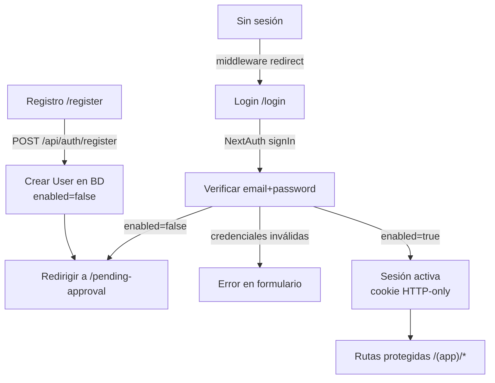

# Autenticación de Usuarios

Implementar autenticación con **NextAuth.js v5** usando el provider `Credentials` (email + contraseña), Prisma como adapter, y bcrypt para hashear contraseñas. Los usuarios se registran solos pero quedan deshabilitados hasta que un administrador los apruebe.

## Flujo general



## Fase 1 — Modelo User y migración

Agregar modelo `User` a [`prisma/schema.prisma`](prisma/schema.prisma):

```prisma
model User {
  id        Int      @id @default(autoincrement())
  email     String   @unique
  password  String
  enabled   Boolean  @default(false)
  createdAt DateTime @default(now())

  @@map("users")
}
```

Crear migración: `npm run db:migrate`

## Fase 2 — Instalar dependencias

```bash
npm install next-auth@beta @auth/prisma-adapter bcryptjs
npm install -D @types/bcryptjs
```

## Fase 3 — Configurar NextAuth

- Crear [`auth.ts`](auth.ts) en la raíz con `NextAuth({ providers: [Credentials] })`.
- La lógica de verificación chequea: credenciales válidas **y** `enabled === true`. Si `enabled === false`, lanza un error específico `"PENDING_APPROVAL"` que el login puede capturar para redirigir.
- Crear [`app/api/auth/[...nextauth]/route.ts`](app/api/auth/[...nextauth]/route.ts) que re-exporta los handlers.
- Agregar `AUTH_SECRET` a `.env`.

## Fase 4 — API de registro

- Crear [`app/api/auth/register/route.ts`](app/api/auth/register/route.ts): `POST` que valida email único, hashea la contraseña con bcrypt y crea el `User` con `enabled: false`.

## Fase 5 — Página de registro

- Crear [`app/register/page.tsx`](app/register/page.tsx): formulario con email, contraseña y confirmar contraseña. Al registrarse con éxito redirige a `/pending-approval`.

## Fase 6 — Página de aprobación pendiente

- Crear [`app/pending-approval/page.tsx`](app/pending-approval/page.tsx): página sin menú que muestra un mensaje del estilo "Tu cuenta está pendiente de aprobación. Un administrador del barrio habilitará tu acceso próximamente."

## Fase 7 — Login funcional

- Actualizar [`app/login/page.tsx`](app/login/page.tsx): reemplazar `console.log` por `signIn("credentials", ...)` de NextAuth. Si el error es `"PENDING_APPROVAL"`, redirigir a `/pending-approval`.

## Fase 8 — Proteger rutas con middleware

- Crear [`middleware.ts`](middleware.ts) en la raíz con dos reglas:
  - Sin sesión → redirigir a `/login`
  - Con sesión pero `enabled=false` → redirigir a `/pending-approval`
- Aplica a todas las rutas bajo `/(app)/*`.

## Archivos a crear/modificar

- **Modificar** [`prisma/schema.prisma`](prisma/schema.prisma) — agregar modelo `User` con `enabled`
- **Crear** migración SQL
- **Crear** [`auth.ts`](auth.ts) — configuración NextAuth
- **Crear** [`app/api/auth/[...nextauth]/route.ts`](app/api/auth/[...nextauth]/route.ts)
- **Crear** [`app/api/auth/register/route.ts`](app/api/auth/register/route.ts)
- **Crear** [`app/register/page.tsx`](app/register/page.tsx)
- **Crear** [`app/pending-approval/page.tsx`](app/pending-approval/page.tsx)
- **Modificar** [`app/login/page.tsx`](app/login/page.tsx)
- **Crear** [`middleware.ts`](middleware.ts)
