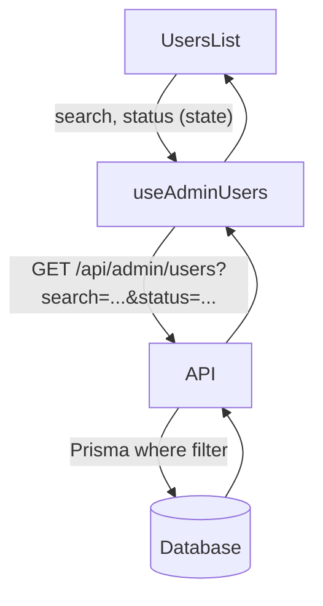

# Plan: Buscar y Filtrar Usuarios Admin

## Archivos a modificar

- [`app/api/admin/users/route.ts`](app/api/admin/users/route.ts) — leer query params y filtrar en Prisma
- [`store/admin/admin.query.ts`](store/admin/admin.query.ts) — pasar params al fetch y al queryKey
- [`app/(app)/admin/usuarios/components/UsersList.tsx`](<app/(app)/admin/usuarios/components/UsersList.tsx>) — agregar UI de búsqueda y filtro arriba de la lista

---

## 1. API — `app/api/admin/users/route.ts`

Leer `search` y `status` de los query params y construir el `where` dinámicamente:

```ts
// GET /api/admin/users?search=foo&status=enabled
const { searchParams } = new URL(req.url);
const search = searchParams.get("search") ?? "";
const status = searchParams.get("status") ?? "all"; // "all" | "enabled" | "disabled"

const where: Prisma.UserWhereInput = {};
if (search) where.email = { contains: search, mode: "insensitive" };
if (status === "enabled") where.enabled = true;
if (status === "disabled") where.enabled = false;

const users = await prisma.user.findMany({ where, select: { ... }, orderBy: { createdAt: "desc" } });
```

El handler pasa de `_req` a `req` para poder leer la URL.

---

## 2. Hook — `store/admin/admin.query.ts`

`useAdminUsers` acepta `{ search, status }` y los incluye en la query key y en el fetch:

```ts
type AdminUsersFilters = {
  search: string;
  status: "all" | "enabled" | "disabled";
};

export function useAdminUsers(filters: AdminUsersFilters) {
  return useQuery<AdminUser[]>({
    queryKey: ["admin", "users", filters],
    queryFn: async () => {
      const params = new URLSearchParams();
      if (filters.search) params.set("search", filters.search);
      if (filters.status !== "all") params.set("status", filters.status);
      const res = await fetch(`/api/admin/users?${params}`);
      if (!res.ok) throw new Error("Error al obtener usuarios");
      return res.json();
    },
  });
}
```

---

## 3. UI — `UsersList.tsx`

El estado de los filtros vive en `UsersList` (ya es Client Component). Arriba de la lista se agregan:

- Un `<input>` de búsqueda con debounce (mismo patrón que `buscar-vehiculo/page.tsx` con `setTimeout`)
- Un botón que abre un dropdown con las opciones de estado

```
[ 🔍 Buscar por email... ]  [ Estado ▾ ]
─────────────────────────────────────────
  usuario@mail.com   Admin  ✅
  otro@mail.com      Usuario ✅
```

El dropdown de estado se implementa con estado local `open` + `position: relative` + Tailwind, sin dependencias externas. Las opciones son: **Todos** / **Habilitados** / **Deshabilitados**.

El label del botón de filtro refleja la selección actual (ej. "Habilitados ▾").

---

## Flujo de datos


