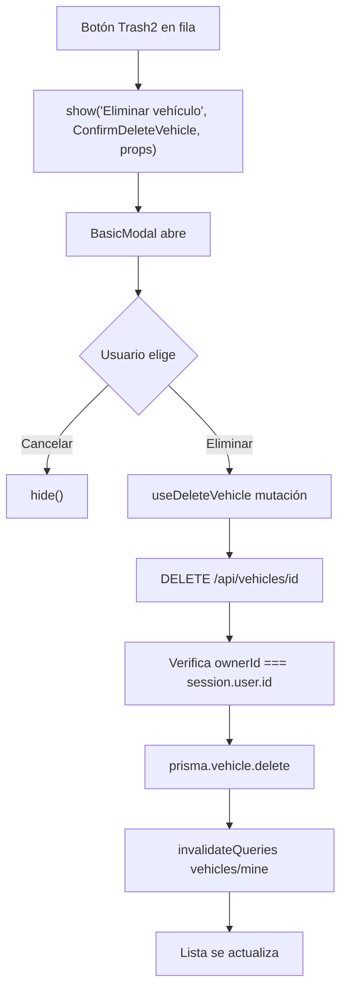

# Plan: Eliminar Vehículo

## Resumen de cambios

```
app/api/vehicles/[id]/route.ts                    ← nuevo endpoint DELETE
store/vehicle/vehicle.query.ts                    ← nuevo hook useDeleteVehicle
app/(app)/mis-vehiculos/components/ConfirmDeleteVehicle.tsx  ← cuerpo del modal de confirmación
app/(app)/mis-vehiculos/components/MyVehicles.tsx ← botón de eliminar + integración modal
```

---

## 1. API — `app/api/vehicles/[id]/route.ts`

Nuevo archivo. Verifica que el vehículo pertenezca al usuario antes de eliminar (seguridad):

```ts
export const DELETE = withAuth(async (req, session) => {
  const id = Number(req.url.split("/").pop());
  const vehicle = await prisma.vehicle.findUnique({ where: { id } });

  if (!vehicle)
    return NextResponse.json({ error: "Not found" }, { status: 404 });
  if (vehicle.ownerId !== Number(session.user.id))
    return NextResponse.json({ error: "Forbidden" }, { status: 403 });

  await prisma.vehicle.delete({ where: { id } });
  return NextResponse.json({ ok: true });
});
```

---

## 2. Hook — `store/vehicle/vehicle.query.ts`

Agregar `useDeleteVehicle` siguiendo el patrón existente:

```ts
export function useDeleteVehicle() {
  const queryClient = useQueryClient();
  return useMutation({
    mutationFn: async (id: number) => {
      const res = await fetch(`/api/vehicles/${id}`, { method: "DELETE" });
      if (!res.ok) throw new Error("Error al eliminar el vehículo");
    },
    onSuccess: () => {
      queryClient.invalidateQueries({ queryKey: ["vehicles", "mine"] });
    },
  });
}
```

---

## 3. Modal de confirmación — `ConfirmDeleteVehicle.tsx`

Componente que se renderiza como cuerpo del `BasicModal`. Recibe `plateNumber`, `vehicleId` y `onConfirm`:

```tsx
interface Props {
  plateNumber: string;
  onConfirm: () => void;
}
```

Contenido: mensaje de confirmación + dos botones:

- "Cancelar" → llama a `hide()` del contexto
- "Eliminar" → llama a `onConfirm()` (que ejecuta la mutación y cierra)

Los botones son full-width y con padding generoso (`py-3`) para comodidad táctil en mobile.

---

## 4. MyVehicles — integración

En cada fila se agrega un botón con el ícono `Trash2` de lucide-react a la derecha. El botón tiene `p-3` para área de toque cómoda en mobile (~48px).

Al pulsarlo llama a `useModal().show()` con el tipo `basicModal`:

```ts
show("Eliminar vehículo", ConfirmDeleteVehicle, {
  plateNumber: vehicle.plateNumber,
  onConfirm: () => {
    deleteVehicle(vehicle.id);
    hide();
  },
});
```

---

## Flujo


