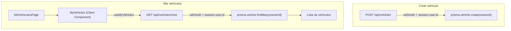

# Plan: Mis Vehículos

## Resumen de cambios

```
prisma/schema.prisma                              ← agregar ownerId en Vehicle
app/api/vehicles/route.ts                         ← asignar ownerId al crear un vehículo
app/api/vehicles/mine/route.ts                    ← nuevo endpoint GET
store/vehicle/vehicle.query.ts                    ← nuevo hook useMyVehicles
app/(app)/mis-vehiculos/page.tsx                  ← página (Client Component)
app/(app)/mis-vehiculos/components/MyVehicles.tsx ← lista de vehículos propios
```

---

## 1. Schema — `prisma/schema.prisma`

Agregar `ownerId` nullable en `Vehicle` (nullable para no romper registros existentes sin dueño) y la relación inversa en `User`:

```prisma
model User {
  id       Int       @id @default(autoincrement())
  // ...campos actuales...
  vehicles Vehicle[]
}

model Vehicle {
  id          Int     @id @default(autoincrement())
  // ...campos actuales...
  ownerId     Int?    @map("owner_id")
  owner       User?   @relation(fields: [ownerId], references: [id])
}
```

Luego correr la migración:

```bash
npx prisma migrate dev --name add-vehicle-owner
```

---

## 2. API POST — `app/api/vehicles/route.ts`

En el handler `POST`, tomar el `session.user.id` que ya pasa `withAuth` y setearlo como `ownerId`:

```ts
export const POST = withAuth(async (req, session) => {
  // ...validaciones actuales...
  const created = await prisma.vehicle.create({
    data: { plateNumber, brand, color, status, ownerId: Number(session.user.id) },
  });
  // ...
});
```

El `GET` general no cambia (buscar-vehiculo sigue mostrando todos los vehículos).

---

## 3. Nuevo endpoint — `app/api/vehicles/mine/route.ts`

Nuevo archivo que devuelve solo los vehículos del usuario autenticado:

```ts
export const GET = withAuth(async (_req, session) => {
  const vehicles = await prisma.vehicle.findMany({
    where: { ownerId: Number(session.user.id) },
    orderBy: { id: "desc" },
  });
  return NextResponse.json(vehicles.map(serializeVehicle));
});
```

Reutiliza `withAuth` y `serializeVehicle` del mismo patrón que el route existente.

---

## 4. Hook — `store/vehicle/vehicle.query.ts`

Agregar `useMyVehicles` siguiendo el mismo patrón de `useVehicles`:

```ts
export function useMyVehicles() {
  return useQuery<Vehicle[]>({
    queryKey: ["vehicles", "mine"],
    queryFn: async () => {
      const res = await fetch("/api/vehicles/mine");
      if (!res.ok) throw new Error("Error al obtener vehículos");
      return res.json();
    },
  });
}
```

---

## 5. Página — `app/(app)/mis-vehiculos/`

Mismo patrón que `buscar-vehiculo`: `page.tsx` es el contenedor y delega el fetch a un sub-componente Client.

**`page.tsx`** — título y renderiza `<MyVehicles />`:

```tsx
"use client";
import { Typography } from "@/components/Typography";
import MyVehicles from "./components/MyVehicles";

const MisVehiculosPage = () => (
  <div className="flex flex-col gap-4">
    <Typography variant="h5">Mis vehículos</Typography>
    <MyVehicles />
  </div>
);
```

**`components/MyVehicles.tsx`** — usa `useMyVehicles`, maneja estados de carga/error/vacío y renderiza la lista. Cada ítem muestra:

- Patente (`plateNumber`)
- Marca (vía `VEHICLE_BRAND_LABELS`)
- Color (vía `VEHICLE_COLOR_META`)
- Estado (`residente` / `visitante`)

---

## Flujo de datos


